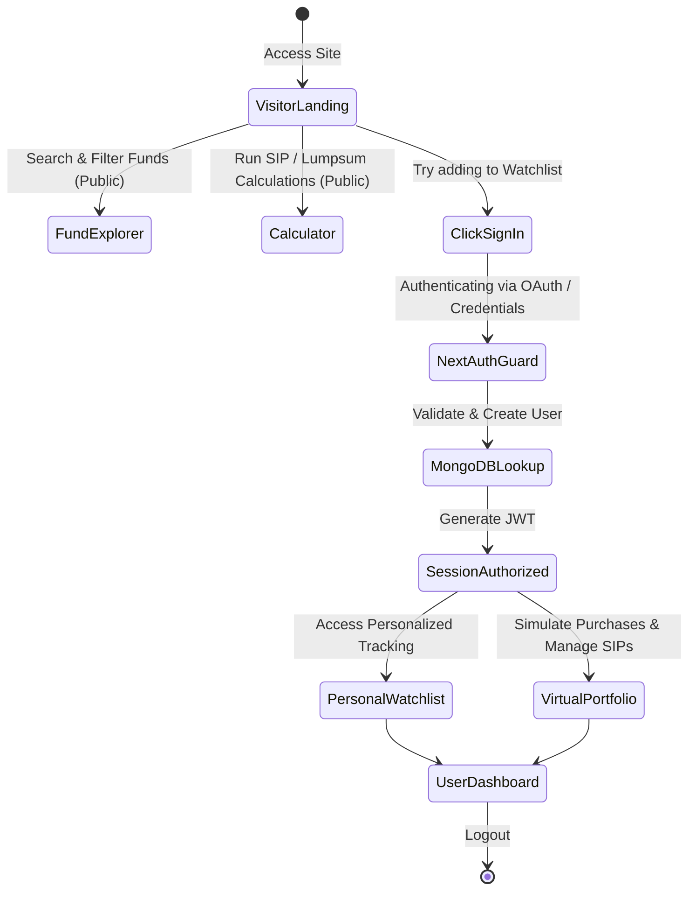
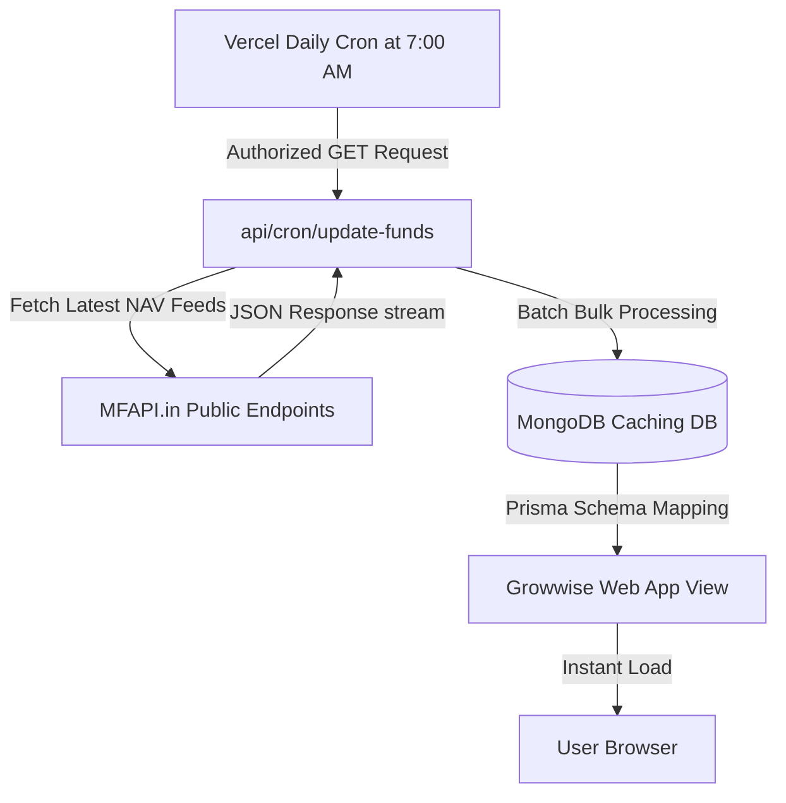

<div align="center">

<!-- Waving FinTech Banner -->


<br/>

<!-- Interactive Typing Header -->
<h1>
  
</h1>

<p align="center">
  
  
  
  
  
</p>

</div>

---

## 🏦 The Intelligent Mutual Fund Explorer

**Growwise** is a premium, full-featured **Next.js 14** financial exploration ecosystem designed to simplify mutual fund tracking, SIP simulation, and portfolio management. By bridging the live feeds of **MFAPI.in** with high-fidelity visualization engines (**Recharts**) and enterprise styling (**Material UI v6**), Growwise empowers investors to evaluate compounding scenarios on verified historical data with zero risk.

---

## 🚀 Key Features Matrix

<div align="center">

| Module | Core Functionality | Technologies Involved |
| :--- | :--- | :--- |
| **🏦 Fund Explorer** | Real-time query matching, advanced categorization, lazy-loaded fund registries. | Next.js 14 Route Handlers, Material-UI, MFAPI.in |
| **📈 Dynamic Analytics** | Historical NAV visualizations, returns calculations (1D, 1M, 3M, 1Y, 5Y). | Recharts, Decimal.js, React Hooks |
| **💰 SIP Simulator** | Compounding calculations on real NAV history, frequency selection, detailed transaction tables. | SIP Return Core Engine, Prisma ORM |
| **👀 Investor Tools** | Personalized Watchlists, multi-portfolio creation, and real-time absolute gain tracking. | NextAuth.js, MongoDB Atlas, React Context |
| **🔄 Auto Data Sync** | Background sync cron-scheduler updates, DB caching, schema index filtering. | Vercel Cron, Next.js Serverless Functions |

</div>

---

## 🏗️ Interactive System Architecture

Explore how **Growwise** handles request routing, authentication states, and real-time background data synchronization:

<details>
<summary>🔑 <b>1. Session Management & User Flow</b></summary>
<br/>

The user lifecycle divides public exploration from private simulated portfolios using secure server-side session guards:


</details>

<details>
<summary>📡 <b>2. Daily Background Sync & Cache Flow</b></summary>
<br/>

To guarantee high speeds, live NAV parameters are cached daily in MongoDB using cron triggers rather than hammering the public endpoints constantly:


</details>

---

## 💻 Tech Stack & Dependencies

```
🌐 FRONTEND     :: Next.js 14 (App Router) • React 18 • TypeScript
🎨 DESIGN STACK :: Material-UI (MUI v6) • Emotion Styles • Tailwind
📊 CHARTS CORE  :: Recharts Engine
📂 DATABASE     :: MongoDB • Prisma ORM
🔐 SECURE AUTH  :: NextAuth.js (JWT)
🔄 SCHEDULER    :: Vercel Cron API / curl integration
```

---

## 📂 Project Directory Structure

```
growwise/
├── prisma/                       # Database Schemas & Migrations
│   └── schema.prisma             # Primary MongoDB ODM structure
├── public/                       # Global Asset Assets & Vectors
├── src/                          # Application Core Files
│   ├── app/                      # Next.js App Router Tree
│   │   ├── api/                  # JSON Service Route Handlers
│   │   │   ├── cron/             # Automated sync pipelines
│   │   │   ├── mf/               # Fund query handlers
│   │   │   └── watchlist/        # User tracking managers
│   │   ├── (auth)/               # Login/Signup modules
│   │   ├── explorer/             # Fund Discovery Grid
│   │   ├── portfolio/            # Interactive virtual ledger
│   │   └── page.tsx              # Landing Hub
│   ├── components/               # Shareable Layout Modules
│   │   ├── navbar.tsx            # Global dynamic header
│   │   └── calculator.tsx        # Compound simulation forms
│   ├── lib/                      # Mathematics Helpers
│   │   └── sip-calculator.ts     # Interest & inflation computation engines
│   └── styles/                   # Core layout tokens
├── vercel.json                   # Cloud deployment structures
└── package.json                  # Dependencies manifest
```

---

## ⚙️ Interactive Customization Terminal

Explore how to fine-tune the compounding calculators or database triggers inside **Growwise**:

<details>
<summary>🏦 <b>1. Advanced Schema Customization (Prisma)</b></summary>

Extend the MongoDB model fields. Open [prisma/schema.prisma](file:///c:/Users/admin/Desktop/Growwise/growwise/prisma/schema.prisma):
```prisma
model Fund {
  id          String    @id @default(auto()) @map("_id") @db.ObjectId
  schemeCode  Int       @unique
  schemeName  String
  fundHouse   String
  category    String
  navs        FundNAV[]
  createdAt   DateTime  @default(now())
}

model FundNAV {
  id         String   @id @default(auto()) @map("_id") @db.ObjectId
  fundId     String   @db.ObjectId
  fund       Fund     @relation(fields: [fundId], references: [id])
  nav        Float
  date       DateTime
}
```
</details>

<details>
<summary>💰 <b>2. Modifying the Compound Math Equations</b></summary>

Add support for customized taxes or inflation adjustments in calculations. Open [src/lib/sip-calculator.ts](file:///c:/Users/admin/Desktop/Growwise/growwise/src/lib/sip-calculator.ts):
```typescript
/**
 * Calculates absolute and annualized compound returns on historical NAV arrays
 */
export function calculateSIPReturns(navHistory: number[], monthlyInvestment: number) {
  let totalInvested = 0;
  let totalUnits = 0;
  
  // Custom formula logic loops:
  navHistory.forEach((nav) => {
    totalUnits += monthlyInvestment / nav;
    totalInvested += monthlyInvestment;
  });
  
  return { totalInvested, totalUnits };
}
```
</details>

---

## 🚀 Setup & Launch Protocol

### 1. Installation
Ensure Node.js 18+ and a running MongoDB Instance are ready:
```bash
# Clone the repository
git clone https://github.com/Jeevan-2275/Growwise.git
cd growwise

# Install package dependencies
npm install
```

### 2. Configure Environment Parameters
Create a `.env.local` file inside the root folder:
```env
DATABASE_URL="mongodb+srv://<user>:<password>@cluster.mongodb.net/growwise"
NEXTAUTH_SECRET="GenerateSecureKeyHere"
NEXTAUTH_URL="http://localhost:3000"
CRON_SECRET="DefineAutomatedSecretPass"
```

### 3. Generate Database Maps & Sync Schemas
Run Prisma DB push to populate indices and build client code maps:
```bash
npx prisma generate
npx prisma db push
```

### 4. Run Development Engine
```bash
npm run dev
```
Open **[http://localhost:3000](http://localhost:3000)** in your browser to start tracking mutual funds immediately!

---

## ⚡ Deployment & Hosting

### Vercel Deployment
Growwise is pre-configured for instant **Vercel** serverless deploys. Connect the repo to your dashboard, hook up your database variable overrides, and push.

### Automating the Daily Cache Updater
To keep funds fresh, hook up the cron path via your local cron-job engine or Vercel schedule config:
```bash
# Trigger updater manually or programmatically:
curl -X GET "https://your-growwise.vercel.app/api/cron/update-funds" \
     -H "Authorization: Bearer your-cron-secret"
```

---

## 📄 License
This project is licensed under the terms of the **MIT License**.

---

<div align="center">

### 🌟 Happy Compounding!
*Empower your financial decisions with smart, visual data.*


</div>